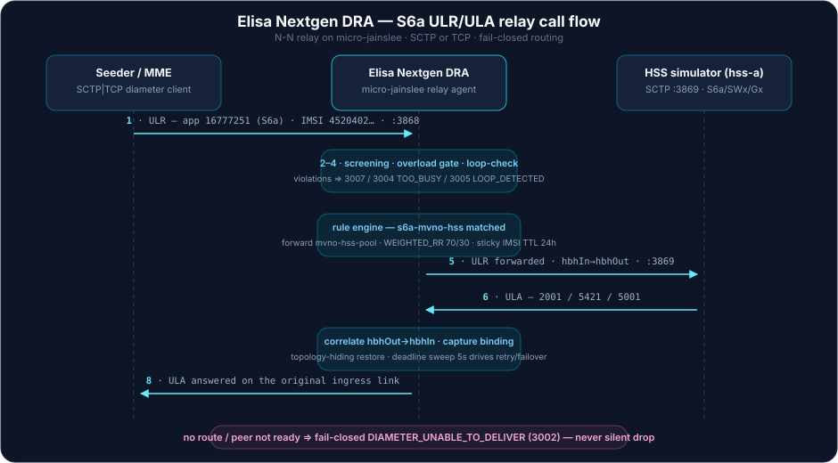
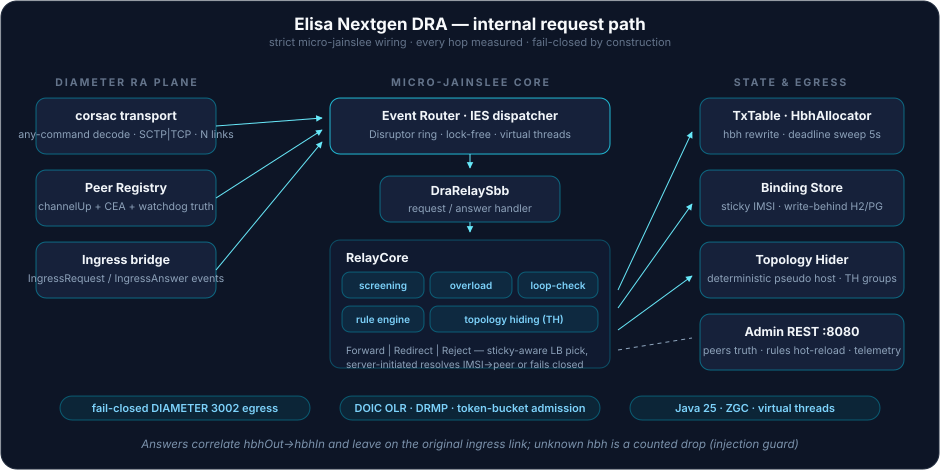

# Elisa Nextgen DRA — Diameter Routing Agent trên micro-jainslee

[🇬🇧 English](README.md)

DRA (Diameter Routing Agent) hiệu năng cao, viết đúng chuẩn một network
function: là ứng dụng **micro-jainslee** với Diameter RA riêng (transport
`ra-diameter`/corsac), làm relay **N-N thực thụ** (N client ↔ N server pool)
với rule engine đầy đủ — realm/host routing, IMSI-prefix routing (MVNO),
load balancing theo trọng số, sticky binding, failover, overload control
(DOIC) và topology hiding.

Trạng thái: **IMPLEMENTED — lab-ready** (278 tests xanh; N-N relay được chứng
minh bằng socket thật cả TCP lẫn SCTP; wiring strict micro-jainslee qua
`MicroSleeContainer`). Chưa công bố số liệu production capacity.

---

## Build & chạy nhanh

```bash
export JAVA_HOME=$(mise where java@zulu-25)   # chỉ JDK 25
mvn clean test                                # full suite (278 tests)
dist-tools/package-dist.sh                    # -> dist/dra (run.sh + configs + html)
```

Database: mặc định H2 file demo (`./data/dra`, không cần cài gì); production
export `DRA_DB_KIND=postgresql` + `DRA_DB_URL/DRA_DB_USER/DRA_DB_PASSWORD`.

### Lab sống tối giản qua SCTP (~2 phút)

```bash
# 1) Simulator HSS/S6a ở :3869 (SCTP là transport mặc định)
java -jar lab/sas-diameter-testapp/target/sas-diameter-testapp-lab.jar \
     --listen-port 3869 --web-port 8086 &

# 2) DRA từ bản dist đã package (peers config: configs/dra-peers.json)
cd dist/lab-run && ./run.sh &                 # Diameter :3868, admin :8080
sleep 15 && cd ../..

# 3) Nạp rules (SoT là REST API; JSON chỉ để seed)
curl -s -X PUT http://127.0.0.1:8080/api/rules -H 'Content-Type: application/json' \
     -d @dist/lab-run/configs/dra-rules-lab.json

# 4) Bắn S6a ULR xuyên qua DRA
java -cp bench/target/classes:dra-core/target/classes \
     et.elisa.dra.bench.SctpSeederClient --host 127.0.0.1 --port 3868 \
     --src-port 38680 --count 4 --imsi-prefix 45204020 \
     --dest-host hss-a.epc.mnc01.mcc452.3gppnetwork.org
# mong đợi: 4/4 có answer, result code 2001 / 2001(barred) / 5421(detached) / 2001

curl -s http://127.0.0.1:8080/api/peers    # peer truth: channelUp+ceaOk+watchdogValid
curl -s http://127.0.0.1:8086/api/messages # ground truth phía simulator
```

---

## Kiến trúc module

| Module | Nội dung |
|---|---|
| `dra-core` | Rule engine định tuyến + config model, transaction table, sticky binding store, các chiến lược LB (`dra-core/.../{engine,tx,bind,lb,overload,screen,th,wire}`) |
| `dra-ra` | Multi-peer Diameter RA trên stack corsac: peer registry N-N với readiness truth (channel up + CEA + watchdog), any-command decode |
| `dra-app` | Wiring micro-jainslee (`app.bootstrap`), relay SBB, admin REST + dashboard HTMX (:8080), persist binding bền bỉ (H2/PostgreSQL qua Flyway) |
| `bench` | Wire codec, fake HSS/MME, seeder TCP + SCTP cho smoke và load test |
| `lab/sas-diameter-testapp` | Simulator HSS/S6a(+SWx/Gx) độc lập dùng làm đích relay |

## Call flow — luồng cuộc gọi

### ULR/ULA xuyên qua DRA (happy path)

<p align="center">
  
</p>

Từng bước:

1. `ULR` inbound (app 16777251, IMSI `4520402…`) vào link server `mme-acc` (:3868, SCTP hoặc TCP).
2. Chuỗi bảo vệ: **screening** (allowlist app/cmd/realm-spoof/IP-CIDR) → **overload gate** (token bucket global+peer, tôn trọng DRMP và OC-OLR) → **loop check** (self trong Route-Record ⇒ 3005).
3. **Rule engine** khớp `s6a-mvno-hss` → forward group `mvno-hss-pool` với `WEIGHTED_RR 70/30`, sticky IMSI (TTL 24 h), failover ≤ 1 lần với cmd retryable (ULR/AIR/PUR/NOR).
4. `TxTable` rewrite `hbhIn→hbhOut` (giữ nguyên e2e); request đi ra trên link CLIENT tới `hss-a` (:3869).
5. Simulator trả `ULA` — `2001` ok/barred, `5421` detached, `5001` user lạ.
6. `RelayCore.onAnswer` correlate `hbhOut→hbhIn`, khôi phục topology-hiding, capture binding IMSI→peer, rồi trả lời **đúng link ingress ban đầu**.
7. Deadline sweep (5 s) điều phối retry/failover; cạn kiệt ⇒ fail-closed `DIAMETER_UNABLE_TO_DELIVER (3002)` — tuyệt đối không silent drop.

### Đường đi nội bộ của một request

<p align="center">
  
</p>

`corsac decode (any-command)` → `IngressRequest(peerId, DiaMsg)` → `DraRelaySbb` (container micro-jainslee định tuyến) → chuỗi bảo vệ `RelayCore` → quyết định rule (`Forward | Redirect | Reject`) → LB chọn peer có tính sticky → rewrite topology-hiding → dòng tx + cấp hbh mới → egress. Request server-initiated (IDR/CLR…) resolve ngược IMSI→peer từ binding store; không binding và không Dest-Host ⇒ fail-closed 3002. Answer hbh lạ được drop có đếm (chống answer injection).

### Peer readiness truth

`LISTEN ≠ ready`. Peer chỉ routable khi `channelUp ∧ ceaOk(2001) ∧ watchdogValid` — poll từ corsac stack mỗi 100 ms, kèm re-check chủ động trước khi bất kỳ send nào fail (`refreshRegistryBeforeFail`).

---

## Admin & quan sát

| Endpoint | Mục đích |
|---|---|
| `GET /api/peers` | readiness truth từng peer + advertised apps |
| `GET/PUT /api/rules` | hot-reload bộ rules có validate (rollback last-good) |
| `GET /api/telemetry` | counters: tx totals, answer classes, gauge throttle/failover/drop |
| `GET :8086/api/messages` | log ring-buffer simulator (ground truth req/ans) |

Config seed nằm ở `configs/`; bản operator dưới `dist/dra/configs` không bao
giờ bị package ghi đè.

## Quy tắc bất di bất dịch

- **Chỉ Java 25** (mise zulu-25). Không bao giờ hạ `maven.compiler.release`.
- Peer truth = CER/CEA live (`isPeerReady()`), LISTEN ≠ ready; không route vào
  peer chưa ready; không trả silent 2xxx khi không deliver được.
- Prove the artifact: test xanh chưa đủ — phải package dist, restart, chứng
  minh live bằng dashboard/API/log + jar mtime.
- Tài liệu thiết kế/spec/research được chủ động giữ khỏi repo (`docs/`,
  `*.md` bị gitignore trừ hai file README).

## Vị trí trong hệ sinh thái Elisa

- **elisa/** (IMS core, Cx qua ra-diameter) đứng sau DRA này.
- **epc/** (full-MVNO core trong tree sip-freeswitch): hợp đồng giao tiếp NNI
  tại `epc/docs/nni/host-mno-interface-contract.md`.
- Xây trên **micro-jainslee** (gia đình container GPLv3) và transport
  corsac-diameter (fork AGPLv3).

## Licensing

Elisa Nextgen DRA dual-license — chọn mô hình phù hợp:

1. **Open source**: các module ứng dụng (`dra-core`, `dra-ra`, `dra-app`,
   `bench`, testapp lab) là **GPLv3** (xem `LICENSE`); gia đình container
   micro-jainslee là GPLv3, transport corsac-diameter kèm theo là **AGPLv3**.
   Chạy agent nguyên trạng trong mạng của bạn không phát sinh nghĩa vụ
   copyleft; phân phối appliance hoặc derivative đóng source thì có.
2. **Commercial license** từ Digicom-ET / Tran Nhan cho operator/vendor cần
   redistribute không dính copyleft, support SLA, hoặc derivative đóng source
   — liên hệ `nhanth87@gmail.com`.

Copyright © 2026 Tran Nhan (nhanth87). Bảo lưu mọi quyền nơi áp dụng.
