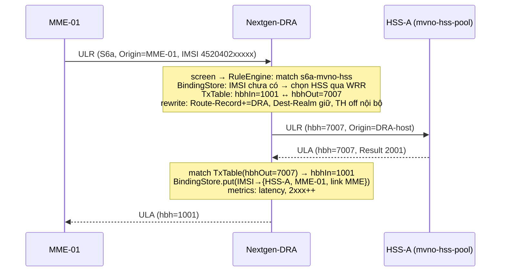
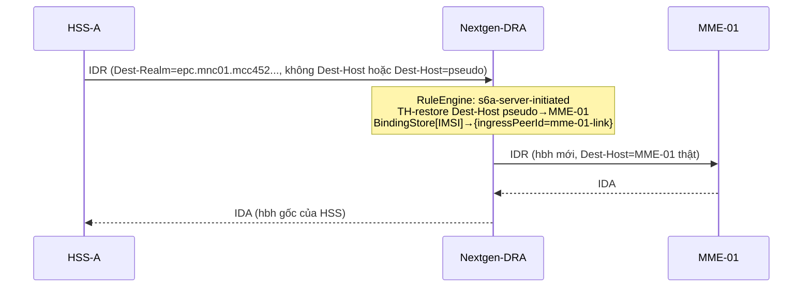
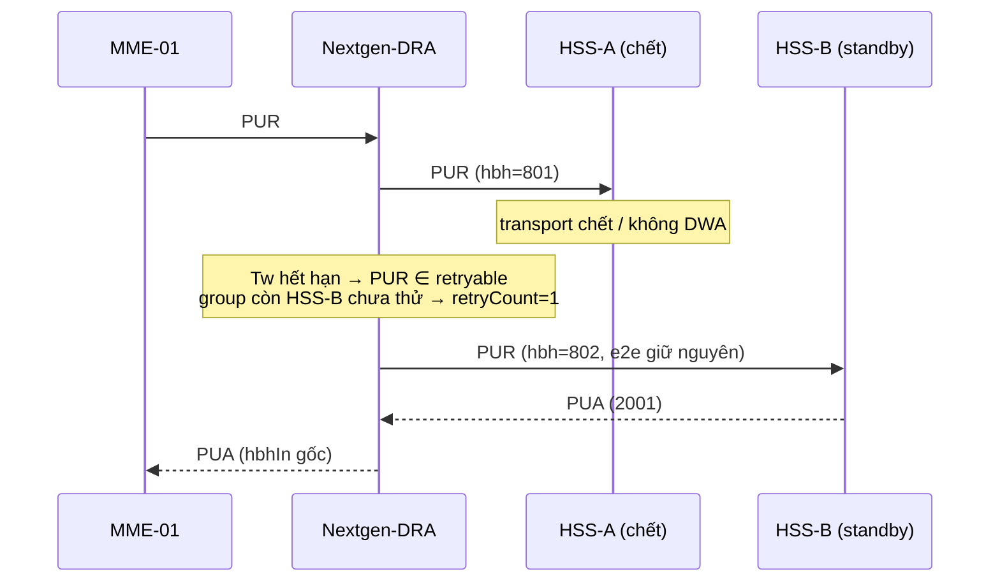

# 02 — Kiến trúc Nextgen DRA

> Ứng dụng **micro-jainslee** (Quarkus-embedded SLEE) + **ra-diameter** mở rộng.
> Mục tiêu hiệu năng: xem §6. Tham chiếu pattern: elisa `ElisaBootstrap`,
> silent-auth bootstrap/config service.

## 1. Bức tranh tổng thể

```
┌───────────────────────────────────────────────────────────────────────┐
│  ADMIN PLANE      HTMX dashboard · REST/JSON API · config hot-reload  │
│                   Prometheus :9090 · jainslee-monitor /telemetry      │
├───────────────────────────────────────────────────────────────────────┤
│  SLEE SERVICE PLANE (micro-jainslee, virtual thread per entity)       │
│                                                                       │
│   DraRelaySbb ──── luồng request/answer chính (mọi app/command)       │
│      │  1. classify + screen        4. rewrite AVP (TH/Route-Record)  │
│      │  2. BindingStore lookup      5. chọn peer từ group (LB)        │
│      │  3. RuleEngine.resolve()     6. TxTable.register(hbh map)       │
│      ├─ DraBindingSbb     (server-initiated routing, TTL sweep)       │
│      ├─ DraOverloadSbb    (DOIC reacting, admission control)          │
│      └─ DraAdminSbb       (config apply/rollback, peer ops)           │
├───────────────────────────────────────────────────────────────────────┤
│  RA LAYER — ra-diameter EXTENDED ("PeerFabric")                       │
│   DiameterRaEndpoint.sendToPeer(peerId, msg) / sendAnswerOnLink(...)  │
│   PeerRegistry (N peers) · capability map · per-peer isPeerReady()    │
│   EventClassifier ANY-command (không drop command lạ)                 │
├───────────────────────────────────────────────────────────────────────┤
│  TRANSPORT — corsac-diameter (local fork, AGPL)                       │
│   CER/CEA/DWR/DWA/DPR/DPA per link · TCP + SCTP multi-stream          │
│   Netty ByteBuf codec (annotation dictionary ~49 app-ID)              │
├───────────────────────────────────────────────────────────────────────┤
│  STATE                                                                │
│   PG: bindings durable + route config SoT + audit                     │
│   Infinispan: cluster cache (binding replication, endpoint lease)     │
│   On-heap lock-free: TxTable, LB wheels, counters (LongAdder)         │
└───────────────────────────────────────────────────────────────────────┘
```

## 2. Maven module layout

```
Nextgen-DRA/
├── pom.xml                        (parent, release=25, quarkus BOM)
├── dra-core/                      # thuần Java 25, không Quarkus/SLEE:
│   ├── engine/    RuleEngine, Rule, Matcher, Action, RouteDecision
│   ├── lb/        LoadBalancer strategies (RR/WRR/least-outstanding/load-aware)
│   ├── tx/        TransactionTable, TxState, HbhKey
│   ├── bind/      BindingStore interface + model (IMSI→peer/host/realm, TTL)
│   ├── th/        TopologyHider (pseudo-host maps, deterministic pick)
│   ├── overload/  AdmissionController, OlrCache, LoadCache, DrmpPolicy
│   └── cfg/       DraConfig model + validator (pure data, JSON/YAML)
├──dra-app/                        # Quarkus + micro-jainslee app:
│   ├── bootstrap/DraBootstrap     (wire container, RAs, SBBs — Elisa-style)
│   ├── sbbs/       DraRelaySbb, DraBindingSbb, DraOverloadSbb, DraAdminSbb
│   ├── admin/      HttpHandler framework-free (silent-auth AdminHttpHandler style)
│   ├── persist/    Panache entities: DraBinding, RouteConfig, AuditLog
│   └── resources/  application.properties, db/migration/*, dra-routes.json
└── dist-tools/
    └── package-dist.sh            (fast-jar → dist/dra/, chuẩn house style)
```

Nguyên tắc: `dra-core` test được không cần socket (unit-test rule/LB/TX thuần);
`dra-app` chỉ là wiring + IO. Giống silent-auth tách `sas-core` khỏi transport.

## 3. Thành phần chi tiết

### 3.1 PeerFabric — mở rộng ra-diameter thành N peers

Hiện trạng ra-diameter: 1 peer (`DiameterRaConfig.peerHost/Port`,
`LINK_ID="diameter-ra"`), Corsac transport register 1 link. Cần:

```java
// cấu hình N peers (JSON trong configs/, SoT ở PG):
peer {
  id: "hss-a"                       // định danh route
  host: "10.0.0.11", port: 3868
  role: CLIENT | SERVER             // ai dial CER trước
  transport: TCP | SCTP
  advertisedApps: [S6A, CX_DX, ...] // giới hạn registerApplication cho link này
  group: "mvno-hss-pool"            // tham chiếu bởi rules
  weight: 70                        // cho WRR
  maxOutstanding: 2000              // admission guard
}
```

API mới trên `DiameterRaEndpoint` (giữ API cũ cho backward-compat):

| Method | Ý nghĩa |
|--------|---------|
| `sendToPeer(peerId, SendDiameterRequest)` | gửi request xuống đúng peer (bỏ qua bảng đích tĩnh) |
| `sendAnswerOnLink(peerId, hbh, e2e, answer)` | trả answer lên ingress-link với hop-by-hop/end-to-end **của ingress** (điểm mấu chốt của relay) |
| `peersReady()` → Map<peerId, PeerHealth> | health truth: state OPEN, channel up, watchdog, outstanding count |
| event `DiameterRequestEvent.ingressPeerId` | biết message đến từ link nào để trả lời đúng chỗ |

PeerRegistry giữ `ConcurrentHashMap<peerId, DiameterLink>`; capability map lấy
từ CEA (app-ID mà peer advertise) — tái dùng `canSendMessage()` của corsac làm
điều kiện lọc cuối cùng khi chọn peer.

**Any-command relay:** bỏ whitelist S6A/CX/GX/CC của
`CorsacDiameterTransport.registerApplication()` → đăng ký toàn bộ
`ApplicationIDs` + thêm fallback trong bridge: command thiếu
`@DiameterCommandDefinition` vẫn bắn `DiameterRequestEvent` dạng raw
(`avpsStructured` rỗng, `rawAvps` octets) — **không bao giờ drop im lặng**.

### 3.2 Transaction layer (`dra-core/tx`)

Mỗi forwarded request tạo một transaction:

```
TxState {
  txId (snowflake)              hbhIn  (hbh phía ingress peer)
  hbhOut (hbh ta cấp cho egress) e2eIn/e2eOut
  ingressPeerId / egressPeerId  appId, cmdCode, sessionId
  drmpPriority                  deadline (nanos, Agrona timer wheel)
  retryCount, triedPeers[]
}
```

- **Answer matching**: answer từ egress mang `hbh == hbhOut` → tra `TxTable`
  (ConcurrentHashMap<Integer,TxState>) → rewrite hbh về `hbhIn`, gửi
  `sendAnswerOnLink(ingressPeerId, …)`. Fix đúng lỗi single-flight của
  silent-auth (01-research §3.4).
- **Timeout wheel**: Agrona `DeadlineTimerWheel` (container đã có). Hết hạn:
  nếu cmd thuộc tập retryable (ULR/PUR/NOR… idempotent) và group còn peer chưa
  thử → failover (§3.5); ngược lại trả ingress
  `DIAMETER_UNABLE_TO_DELIVER` (3002).
- **Cleanup**: remove khi answer hoặc deadline; counter leak-guard
  (`txActive` gauge phải về 0 sau load test).

### 3.3 RuleEngine (`dra-core/engine`) — chi tiết đầy đủ ở `03-routing-rules.md`

Input: `RoutingContext{ingressPeerId, appId, cmdCode, flags(R/E/P bits),
DRMP, extracted keys: IMSI, MSISDN, VisitedPLMN, FramedIP, DestinationHost/
Realm, OriginHost/Realm}` → output `RouteDecision`:

```
FORWARD(group, sticky?) | REDIRECT(host[,realm]) | REJECT(resultCode[,msg])
| LOCAL_HANDLED (hiếm: DWR/CER do RA tự trả nên không vào đây)
+ danh sách AVP transforms áp kèm (append Route-Record, TH rewrite…)
```

Rule list là **immutable sorted array**, đánh giá tuần tự theo priority —
O(rules) nhưng rules thường < 100; matcher AVP-path dùng pre-compiled key
extractor (không regex runtime).

### 3.4 BindingStore (`dra-core/bind`)

| Key | Value | Ghi |
|-----|-------|-----|
| `IMSI:<imsi>` | {hssGroupId?, chosenPeerId, originHost/Realm của MME, ingressPeerId lúc ULR} | bắt khi thấy ULR/AIR/PUR; dùng cho (a) stickiness các lần sau, (b) server-initiated CLR/IDR từ HSS tìm đúng MME-link |
| `GPCAN:<framed-ip>+<apn?>` | PCRF peer/group | PCC binding TS 29.213 |
| `MSISDN:<msisdn>` | như IMSI (Zh/Zn…) | |

- TTL mặc định 24h (S6a), sweep bằng timer-wheel; refresh mỗi lần hit.
- Persist PG (`dra_binding`) + replicate Infinispan (`dist` mode) cho cluster;
  on-heap cache LRU trước PG (read-heavy).
- **Fail-closed**: server-initiated request không có binding và không có
  Destination-Host ⇒ trả `DIAMETER_UNABLE_TO_DELIVER`, không đoán mò.

### 3.5 Failover

- Trigger: send IOException, watchdog expired giữa chừng, Tw timeout, answer
  mang result-code 3002/5012/5xxx transport-class.
- Điều kiện retry: request chưa từng được answer, cmd ∈ retryable set, còn peer
  healthy trong group chưa thử. Retry giữ nguyên end-to-end, cấp hbh-out mới.
- Peer hỏng liên tục → circuit-breaker per-peer (open nửa giây, half-open probe).

### 3.6 OverloadGuard (`dra-core/overload`)

- **DOIC reacting node**: parse `OC-Supported-Features`(621)/`OC-OLR`(623) trong
  answer → OlrCache{reporting-node → reduction-% đến hết validity}; LB trừ peer
  bị report khỏi candidate hoặc giảm weight.
- **Load reports RFC 8583**: `Load`(681) HOST-type → LoadCache, LB
  load-aware strategy đọc.
- **DRMP**: priority thấp bị throttle đầu tiên khi bucket đầy
  (default PRIORITY_10).
- **Admission control**: token-bucket per-ingress-peer + global; vượt ngưỡng trả
  `DIAMETER_TOO_BUSY` (3004) cho request non-critical, ưu tiên giữ ULR/auth.

### 3.7 TopologyHider (`dra-core/th`) — chế độ DEA/biên IR.88

- Mapping real↔pseudo host: `hss-a.epc.mnc01.mcc452.3gppnetwork.org` ↔
  `dra-edge-<n>.epc.mnc01.mcc452.3gppnetwork.org`; pseudo pick **deterministic
  theo IMSI** (hash) để HSS đối tác không tưởng ULR từ MME mới → tránh CLR storm
  (bài học Oracle S6a/S6d TH).
- Rewrite Origin/Destination-Host, Session-Id (thành phần host), append
  Route-Record thật phía trong, strip phía ngoài; chiều ngược restore từ map.
- Chỉ bật theo peering có flag `topologyHiding: true`.

### 3.8 Telemetry

- Counters LongAdder: `dra_tx_total{peer,app,cmd}`, `dra_answer resultCode
  class{2xxx,3xxx,4xxx,5xxx}`, `dra_failover_total`, `dra_throttled_total`,
  `dra_binding_size`, `dra_tx_active`.
- Latency: HDR histogram per app (agent-added latency = answer-time − rx-time,
  p50/p99/p999).
- Export qua `ra-prometheus-exporter` (:9090) + `/api/telemetry/snapshot`
  của jainslee-monitor. Không log body message ở INFO (hot-path law).

## 4. Luồng message chính

### 4.1 Relay ULR: MME → DRA → HSS pool (client→server)



### 4.2 Server-initiated: HSS → DRA → đúng MME (nhờ binding)



Không có binding & không Dest-Host ⇒ `IDA` error `DIAMETER_UNABLE_TO_DELIVER`
(fail-closed, không đoán).

### 4.3 Failover giữa chừng



## 5. Threading model

| Tầng | Thread | Ghi chú |
|------|--------|---------|
| Codec + link I/O | Corsac WorkerPool (configurable, mặc định 4) + SCTP/TCP worker threads | decode trên transport thread, xử lý queue per-session (`MessageProcessingTask`) |
| SLEE bus | LMAX Disruptor ring (buffer-size 8192–16384 cho DRA) | `fireEvent` từ RA |
| Xử lý SBB | **virtual thread per Session-Id entity** (`prefer-virtual-threads=true`, `sbb-per-virtual-thread=true`) | ordering tự nhiên per session; rule eval < 10µs |
| Timers (Tw, TTL sweep, breaker) | Agrona DeadlineTimerWheel container | không daemon riêng |
| Outbound | gọi trực tiếp `sendToPeer` từ SBB thread → corsac link queue | không block chờ socket |

Hot-path luật nhà (elisa capacity-1m): chỉ LongAdder, zero alloc không cần
thiết, không lock trong path, không log body, PG không nằm trên đường request
(binding write-behind async batch).

## 6. Target hiệu năng — thang trung thực (theo house-style elisa)

| Bậc | Gate | Đo bằng |
|-----|------|---------|
| LAB | 1k TPS 15 phút, 0 loss, tx_active về 0 | harness seeder corsac LoadTest-style |
| NODE_10K | **10k TPS/node sustained 60s**, p99 agent-added ≤ 5 ms, failover peer-kill không mất tx đã accepted > 99.99% | bench script + Prometheus |
| STRETCH_25K | 25k TPS/node nếu codec cho phép (reflection overhead corsac là biến số cần đo ở P1) | như trên |
| CLUSTER_1M | N×10k, binding nhất quán, không split-brain | chaos drill |

Cảnh số liệu: con số bus SLEE 54k ev/s là **dispatch throughput**, không phải
wire throughput Diameter end-to-end — benchmark wire thật là gate bắt buộc
(P1), không claim trước.

## 7. Config & persistence

- `configs/application.properties` (Quarkus, không clobber khi rsync) +
  `configs/dra-peers.json` + `configs/dra-rules.json` (seed).
- **SoT routes/rules/peers = PG** (`route_config` versioned); file là seed ban
  đầu. Hot reload: REST/HTMX → validate (`DraConfigValidator`: tham chiếu group
  tồn tại, app-ID hợp lệ, không route-loop realm) → apply atomic swap
  (volatile reference) → last-good rollback khi sai (pattern
  silent-auth `DiameterAdminSupport`).
- Audit mọi thay đổi config vào `audit_log` (ai, khi nào, diff).

## 8. HA / cluster

- ≥2 node DRA, chung VIP (L4) hoặc DNS nhiều A-record (clients tự connect cả
  hai — Diameter native multi-connection).
- Infinispan `DIST_SYNC` cache-name `dra-cluster`: binding replication +
  **endpoint lease** (peer TCP chỉ owner node nhận — kế thừa
  `DiameterResourceAdaptor.initHa()` lease sẵn có).
- Session-Id stickiness: answer luôn quay đúng node đang giữ TxTable vì hbh
  chỉ có ý nghĩa trên link đó (link sở hữu bởi 1 node nhờ lease).
- Restart node: binding từ PG/ISPN sống; tx đang bay chết theo link — client
  Diameter retry (Tw của họ) sẽ vào node khác.

## 9. Security

- Per-peering allowlist: app-ID set + command-code set + IP prefix (NNI contract
  của epc yêu cầu đúng vậy).
- Screening: chống spoof `Origin-Realm` không khớp peering; drop `Proxy-State`
  lạ; normalize Result-Code.
- Transport: TCP/SCTP nội bộ GRX; **TLS gap của corsac** → quyết định ở P0:
  (a) thêm `SslHandler` Netty vào fork corsac (TCP only; SCTP cần DTLS — hoãn),
  hoặc (b) TLS-terminating sidecar (stunnel/envoy) cho biên IR.88, hoặc (c)
  IPsec ở tầng mạng (TS 33.210) — khuyến nghị (a)+(c), ghi decision record.
- AGPL: fork corsac công khai source phần sửa (đã là local fork từ trước).

## 10. Packaging (chuẩn nhà — non-negotiable)

```
dist/dra/
├── run.sh               # JDK-25-only guard, ZGC, ExitOnOutOfMemoryError
├── quarkus-run.jar
├── dra-app.jar          # thin runner (legacy-jar build)
├── lib/boot/ lib/main/ quarkus/
├── html/                # HTMX admin UI (chỉ file tĩnh, không jar)
├── configs/             # application.properties + dra-*.json (operator sở hữu)
└── logs/
```

`tools/package-dist.sh` copy `tools/package-dist.sh` của elisa: JDK-25 guard,
verify bytecode major 69, không clobber `configs/` khi upgrade. Prove-artifact:
sau deploy phải chứng minh live — dashboard hiện peer READY, 1 ULR test đi qua,
jar mtime + PID classpath khớp bản mới.

## 11. SBB composition (micro-jainslee)

| SBB | Trách nhiệm | Events |
|-----|-------------|--------|
| `DraRelaySbb` | path chính: screen → rule → tx → forward; answer correlation | `DiameterRequestEvent`, `DiameterAnswerEvent` (map sealed-root → 1 mapping bắt mọi command) |
| `DraBindingSbb` | capture binding keys, TTL sweep, server-initiated resolution | như trên + timer |
| `DraOverloadSbb` | DOIC/Load parse, admission verdict | như trên |
| `DraAdminSbb` | apply config, peer enable/disable, drain | REST-triggered internal event |

IES: `@InitialEventSelect` chọn session-key = `sessionId` (per-dialog ordering);
answer event attach vào activity Session-Id tương ứng. Base protocol
(257/280/282) không bao giờ tới SBB — RA tự trả (peer tracker).
